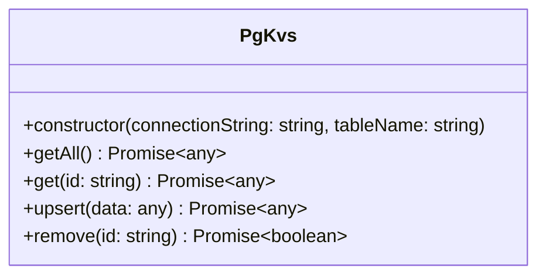

# @tomsd/pgkvs

It's a key value store handler that the repository is a postgresql database, for easy-use.


[](https://www.npmjs.com/package/@tomsd/pgkvs)

## installation

``` shell
npm install @tomsd/pgkvs
```

## interfaces



``` typescript
import { PgKvs } from "@tomsd/pgkvs";

const uri = "postgres://...";
const tableName = "testTable";

(async () => {

  const store = new PgKvs(uri, tableName);

  const record = await store.upsert({
    name: "test"
  });

  console.log(record); // { _id: "xxx", name: "test" }

  console.log(
    await store.getAll()
  ); // [{ _id: "xxx", name: "test" }]

  console.log(
    await store.upsert({
      ...record,
      name: "alt",
      value: 123
    })
  ); // { _id: "xxx", name: "alt", value: 123 }

  console.log(
    await store.remove(record._id)
  ); // true
})();

```
